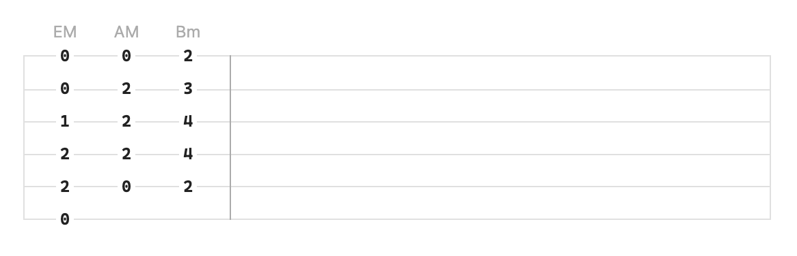
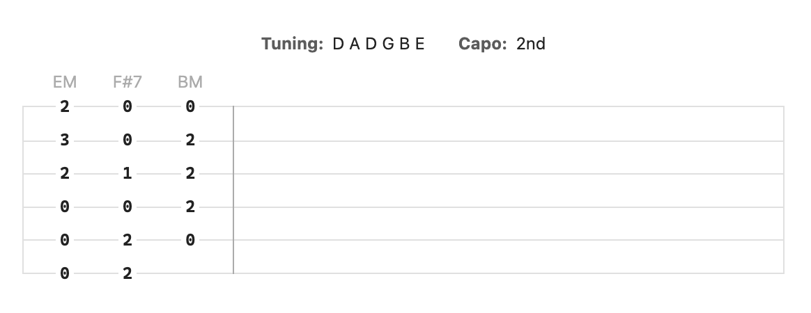

# Obsidian Guitar Tabs

An Obsidian plugin for rendering guitar tablature with an emphasis on rendering chords. The orientation for writing the chords is horizontal rather than vertical, which is much easier for quickly editing and arranging the music. It will be rotated when rendering, for example:

````
```chords
0 2 2 1 0 0
- 0 2 2 2 0
- 2 4 4 3 2
```
````

Will be rendered as:



You can also optionally add alternate tuning and/or a capo:

````
```chords
tuning: D A D G B E
capo: 2

0 0 0 2 3 2
2 2 0 1 0 0
- 0 2 2 2 0
```
````

Will be rendered as:


